277A Project
================
Summer Le
2026-09-28

# Simulate stationary process

``` r
set.seed(555)
# number of observations
n = 10000     
# AR(2) coefficient outside unit circle for causality
phi  = c(1.27, -0.81)  
# check polyroot
polyroot(c(1,1.27-0.81))
```

    ## [1] -2.173913+0i

``` r
 # white noise standard deviation
sigma = 1           

# Initialize the series
sim_x = numeric(n)

# Generate white noise
epsilon = rnorm(n, mean = 0, sd = sigma)

# Initialize the first 2 observations
sim_x[1] = epsilon[1]
sim_x[2] = phi[1] * sim_x[1] + epsilon[2]

for (t in 3:n) {
  sim_x[t] = phi[1] * sim_x[t-1] + phi[2] * sim_x[t-2] + epsilon[t]
}


sim_x %>% plot()
```

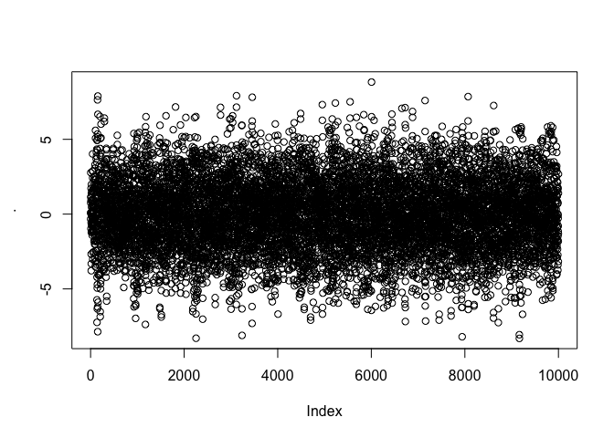<!-- -->

``` r
png("tsdisplay_sim_x.png",
    width = 4000,      
    height = 3000,
    res = 600)          
tsdisplay(sim_x, main = "Observed data")
dev.off()
```

    ## quartz_off_screen 
    ##                 2

## True ACVF

## True spectral density

``` r
max_lag = sqrt(n)
# theoretical acvf from underlying DGP
true_gamma = tacvfARMA(phi = phi, maxLag = max_lag, sigma2 = 1)

# Compute spectral density at frequencies
omega = seq(0, pi, length.out = 500)
spec_density = numeric(length(omega))

for (i in 1:length(omega)) {
  # Use finite sum approximation
  spec_density[i] =  true_gamma[1] + 2 * sum(true_gamma[2:length(true_gamma)] * cos(omega[i] * 1:max_lag))
  spec_density[i] = spec_density[i] / (2 * pi)
}

spec_density_df = as.data.frame(spec_density)
head(spec_density_df)
```

    ##   spec_density
    ## 1    0.5457766
    ## 2    0.5458510
    ## 3    0.5460724
    ## 4    0.5464363
    ## 5    0.5469371
    ## 6    0.5475709

``` r
# Plot
spec_density_df %>% ggplot(mapping = aes(x = spec_density)) +
  # add histogram
  # geom_histogram(color="black", fill="slategray3") +
  geom_density(color= "slategray3") +
  # adding title, x and y labels
  labs(title = "True Spectral Density",
       y = "Frequency") +
  # customize tiitle and axis labels (position, text size, bold/italic)
  theme(plot.title = element_text(size = 15, face = "bold", hjust = 0.5)
        # ,axis.title.x = element_text(size = 20),
        # axis.title.y = element_text(size = 20),
        # axis.text.x = element_text(size = 15)
        ) + 
  xlab("Spectral Density")
```

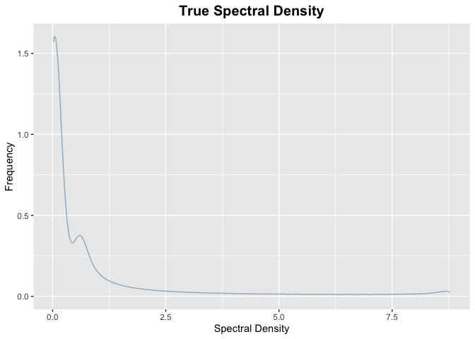<!-- -->

``` r
# ?geom_density
```

# Non parametric method

## Functions

### Truncation

``` r
L = 256

segment_timeseries = function(sim_x, L, overlap ) {
  # shift operator: if overlap is 30 => shift to start at last 70% length
  D = as.integer(L * (1 - overlap))
  
  # Calculate number of segments
  n = length(sim_x)
  num_segments = floor((n - L) / D) + 1
  
  # Initialize matrix: rows are time points (t), columns are segments (k)
  segments_matrix = matrix(NA, nrow = L, ncol = num_segments)
  
  # Fill in segments
  for (k in 1:num_segments) {
    start_idx = (k - 1) * D + 1  # R uses 1-based indexing
    end_idx = start_idx + L - 1
    
    if (end_idx <= n) {
      # X_t^(k) = X_{t+(k-1)D} for t = 1, 2, ..., L
      segments_matrix[, k] = sim_x[start_idx:end_idx]
    }
  }
  
  # Remove any columns that are all NA (shouldn't happen with correct calculation)
  # segments_matrix = segments_matrix[, !apply(is.na(segments_matrix), 2, all), drop = FALSE]
  
  return(segments_matrix)
}


# head(segments)
```

### Window function

``` r
bartlett_window = function(L) {
  t = 0:(L-1)
  w = ifelse(t <= (L-1)/2, 
              2*t/(L-1),           # Rising part
              2 - 2*t/(L-1))       # Falling part
  return(w)
}


hanning_window = function(L) {
  t = 0:(L-1)
  w = 0.5 * (1 - cos(2*pi*t/(L-1)))
  return(w)
}


blackman_window = function(L) {
  t = 0:(L-1)
  a0 = 0.42
  a1 = 0.5
  a2 = 0.08
  w = a0 - a1*cos(2*pi*t/(L-1)) + a2*cos(4*pi*t/(L-1))
  return(w)
}
```

### Windowed series

``` r
apply_window =  function(xtk, wt){
  y_t = xtk * wt
  return(y_t)
}
```

### Calculate U_w

``` r
uw = function(wt){
  u = sum(wt^2)/length(wt)
  return(u)
}
```

### Periodogram estimation

$$I_k(\omega)= \frac{1}{2\pi L\,U_w} \left|\sum_{t=0}^{L-1}Y^{(k)}_t\, e^{-i \omega t}\right|^2$$

``` r
# Compute periodogram for all frequencies and all segments
periodogram_func = function(uw, ytk, omega_grid){
  # number of segments
  K = ncol(ytk)  
  # length of each segment
  L = nrow(ytk)  
  n_freq = length(omega_grid)
  periodogram = matrix(0, nrow = n_freq, ncol = K)
  # periodogram for each segment across all frequencies
  for (j in 1:n_freq) {
    omega = omega_grid[j]
    for (k in 1:K) {
      norm_const = 1/(2*pi*L*uw)
      ss = abs(sum(ytk[,k]*exp(-1i*omega*(0:(L-1)))))^2
      periodogram[j, k] = norm_const*ss
    }
  }
  return(periodogram) 
}
```

### Welch’s estimator

``` r
f_welch_func = function(periodogram){
  # periodogram is a matrix: rows = frequencies, cols = segments
  # Welch's estimate: average across segments for each frequency
  f_hat = rowMeans(periodogram)
  return(f_hat)  
}
```

## Implementation

### Trucation

``` r
L = 256

# Get overlapping segments with 50% overlap
xtk = segment_timeseries(sim_x, L, overlap = 0.5)

cat("Time series length:", length(sim_x), "\n")
```

    ## Time series length: 10000

``` r
cat("Segment length (L):", L, "\n")
```

    ## Segment length (L): 256

``` r
cat("Number of segments:", ncol(xtk), "\n")
```

    ## Number of segments: 77

``` r
cat("Matrix dimensions (rows x cols):", nrow(xtk), "x", ncol(xtk), "\n\n")
```

    ## Matrix dimensions (rows x cols): 256 x 77

### Test using Bartlett

``` r
# Get bartlett window 
bart_wt = bartlett_window(256)
# apply bartlett window
bart_windowed_series = apply_window(xtk, bart_wt)
# Calculate u_w for bartlett
bart_u = uw(bart_wt)
# calculate periodogram for each segment and all frequencies
bart_periodogram = periodogram_func(uw = bart_u, ytk = bart_windowed_series, 
                                    omega_grid = omega)
dim(bart_periodogram)
```

    ## [1] 500  77

``` r
# calculate welch estimate 
bart_f_hat = f_welch_func(bart_periodogram)

# plot true vs estimate
plot(omega, spec_density, type = "l", lwd = 2, col = "red",
     main = "Welch's Estimate vs True Spectral Density",
     xlab = "Frequency", ylab = "Spectral Density")
lines(omega, bart_f_hat, col = "blue", lwd = 2, lty = 2)
legend("topright", c("True", "Welch Estimate Usin Bartlett"), 
       col = c("red", "blue"), lwd = 2, lty = c(1, 2))
```

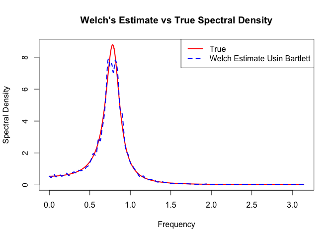<!-- -->

## Fine tune using WISE

``` r
# Function to compute WISE
compute_wise = function(f_hat, f_true, omega, weight = NULL) {
  if (is.null(weight)) {
    weight = rep(1, length(omega))
  }
  
  # Numerical integration using trapezoidal rule
  dw = omega[2] - omega[1]  # assuming uniform grid
  integrand = weight * (f_hat - f_true)^2
  wise = sum(integrand) * dw
  return(wise)
}
```

``` r
# a vector for all values of L I want to test
tune_L = c(256,512, 1024)
windows = c("hann", "bartlett", "blackman")

# a matrix for all windows with all lengths of L
wise_matrix = matrix(NA_real_, nrow = length(tune_L), ncol = length(windows),
              dimnames = list(paste0("L=", tune_L), windows))

# Store f_hat estimates for plotting
f_hat_storage = array(NA_real_, 
                      dim = c(length(omega), length(windows), length(tune_L)),
                      dimnames = list(NULL, windows, paste0("L=", tune_L)))

window_functions = list(
  bartlett = bartlett_window,
  hann = hanning_window,
  blackman = blackman_window
)


# Loop through L values
for (l in 1:length(tune_L)) {
  L_current = tune_L[l]
  
  cat("Processing L =", L_current, "...\n")
  
  xtk = segment_timeseries(sim_x, L_current, overlap = 0.5)
  
  # Loop through window types
  for (w in 1:length(windows)) {
    window_name = windows[w]
    
    cat("  Window:", window_name, "...")
    
    # Get the appropriate window function and call it
    wt = window_functions[[window_name]](L_current)
    
    # Apply window
    windowed_series = apply_window(xtk, wt)
    u_w = uw(wt)
    
    # Periodogram and Welch estimate
    periodogram = periodogram_func(uw = u_w, 
                                   ytk = windowed_series, 
                                   omega_grid = omega)
    f_hat = f_welch_func(periodogram)
    
    # Store WISE
    wise_matrix[l, window_name] = compute_wise(f_hat = f_hat, 
                                                f_true = spec_density,
                                                omega = omega)
    
    # Store f_hat for this configuration
    f_hat_storage[, w, l] = f_hat
    
  }
}
```

    ## Processing L = 256 ...
    ##   Window: hann ...  Window: bartlett ...  Window: blackman ...Processing L = 512 ...
    ##   Window: hann ...  Window: bartlett ...  Window: blackman ...Processing L = 1024 ...
    ##   Window: hann ...  Window: bartlett ...  Window: blackman ...

``` r
print(wise_matrix)
```

    ##             hann  bartlett  blackman
    ## L=256  0.1485399 0.1502452 0.1690006
    ## L=512  0.2332924 0.2328624 0.2495041
    ## L=1024 0.4367854 0.4610079 0.4599805

``` r
# Save results to a list for easy access
results = list(
  wise_matrix = wise_matrix,
  f_hat_storage = f_hat_storage,
  omega = omega,
  spec_density_true = spec_density,
  tune_L = tune_L,
  windows = windows
)
```

### Plot

``` r
# Example: Plot for L = 512
L_idx = which(tune_L == 512)
window_colors = c( "#0072B2", "#E69F00", "#009E73")

par(mfrow=c(3,1))

for (L_index in 1:length(results$tune_L)){
  plot(results$omega, results$spec_density_true, type = "l", lwd = 2, col = "black",
     main = paste("L =", results$tune_L[L_idx]),
     xlab = "Frequency", ylab = "Spectral Density")
  for (w in 1:length(results$windows)){
    lines(results$omega, results$f_hat_storage[, w, L_idx], 
        col = window_colors[w], lwd = 2, lty = 2)
  }
}
legend("topright", 
       legend = c("True", results$windows), 
       col = c("black", window_colors), 
       lwd = 2, lty = c(1, 2, 2, 2))
```

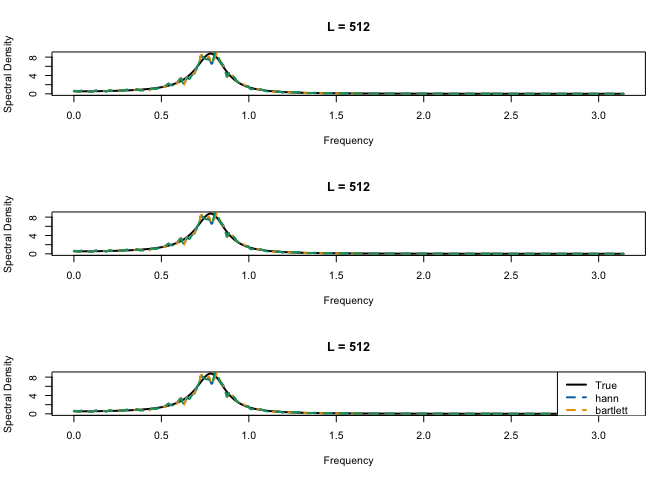<!-- -->

``` r
library(patchwork)

window_colors = c("#0072B2", "#E69F00", "#009E73")
window_names  = results$windows

# Function to build a tidy df for one segment length L
make_df = function(L_value) {
  L_idx = which(results$tune_L == L_value)
  
  df_true = tibble(
    omega = results$omega,
    value = results$spec_density_true,
    type  = "True",
    L     = paste0("L = ", L_value)
  )
  
  df_windows = map_dfr(seq_along(window_names), function(w) {
    tibble(
      omega = results$omega,
      value = results$f_hat_storage[, w, L_idx],
      type  = window_names[w],
      L     = paste0("L = ", L_value)
    )
  })
  
  bind_rows(df_true, df_windows)
}

# Create data for L = 256, 512, 1024
df_256  = make_df(256)
df_512  = make_df(512)
df_1024 = make_df(1024)

# Function to make a single ggplot object
make_plot = function(df) {
  ggplot(df, aes(x = omega, y = value, color = type, linetype = type)) +
    geom_line(size = 1) +
    scale_color_manual(
      values = c("True" = "black", set_names(window_colors, window_names))
    ) +
    scale_linetype_manual(
      values = c("True" = "solid", set_names(rep("dashed", length(window_names)), window_names))
    ) +
    labs(
      title = unique(df$L),
      x = "Frequency",
      y = "Spectral Density",
      color = "Window",
      linetype = "Window"
    ) +
     coord_cartesian(xlim = c(0, 2)) +  
   theme(axis.title.y = element_text(size = 10))
}

# Make the 3 plots
p256  = make_plot(df_256)
```

    ## Warning: Using `size` aesthetic for lines was deprecated in ggplot2 3.4.0.
    ## ℹ Please use `linewidth` instead.
    ## This warning is displayed once per session.
    ## Call `lifecycle::last_lifecycle_warnings()` to see where this warning was
    ## generated.

``` r
p512  = make_plot(df_512)
p1024 = make_plot(df_1024)

compare_window_plot = (p256 / p512 / p1024) +
  plot_layout(guides = "collect") &
  theme(legend.position = "bottom")

compare_window_plot
```

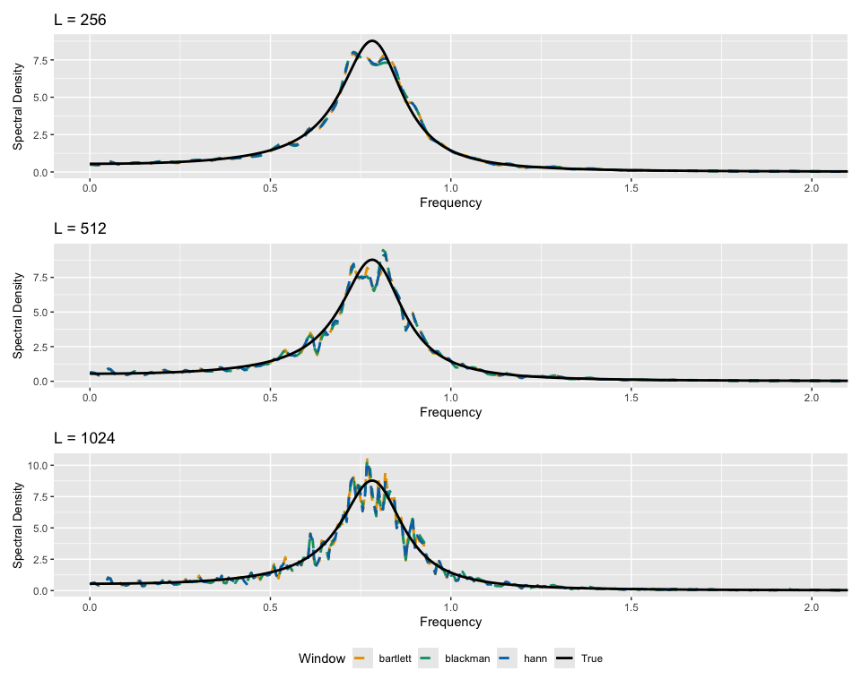<!-- -->

``` r
ggsave("compare_window_plot.png",
       plot = compare_window_plot,
       path = getwd(),
       width = 9, height = 7, dpi = 1200)

here::here("compare_window_plot.png")
```

    ## [1] "/Users/summerletan/Documents/UCSB/Classes/PSTAT_277/277A/Project/compare_window_plot.png"

## Using KL divergence

``` r
compute_kl_divergence = function(f_true, f_hat, omega) {
  # Add small constant to avoid log(0) or division by zero
  epsilon = 1e-10
  f_true_safe = pmax(f_true, epsilon)
  f_hat_safe = pmax(f_hat, epsilon)
  
  # Numerical integration using trapezoidal rule
  dw = omega[2] - omega[1]  # assuming uniform grid
  integrand = f_true_safe * log(f_true_safe / f_hat_safe)
  kl = sum(integrand) * dw
  
  return(kl)
}

# Initialize KL divergence matrix 
kl_matrix = matrix(NA_real_, nrow = length(tune_L), ncol = length(windows),
                   dimnames = list(paste0("L=", tune_L), windows))

for (l in 1:length(tune_L)) {
  L_current = tune_L[l]
  
  for (w in 1:length(windows)) {
    window_name = windows[w]
    
    # Get stored f_hat
    f_hat = f_hat_storage[, w, l]
    
    # Compute KL divergence
    kl_matrix[l, window_name] = compute_kl_divergence(f_true = spec_density,
                                                       f_hat = f_hat,
                                                       omega = omega)
  
  }
}

stargazer::stargazer(kl_matrix)
```

    ## 
    ## % Table created by stargazer v.5.2.3 by Marek Hlavac, Social Policy Institute. E-mail: marek.hlavac at gmail.com
    ## % Date and time: Mon, Sep 28, 2026 - 11:27:58
    ## \begin{table}[!htbp] \centering 
    ##   \caption{} 
    ##   \label{} 
    ## \begin{tabular}{@{\extracolsep{5pt}} cccc} 
    ## \\[-1.8ex]\hline 
    ## \hline \\[-1.8ex] 
    ##  & hann & bartlett & blackman \\ 
    ## \hline \\[-1.8ex] 
    ## L=256 & $0.056$ & $0.067$ & $0.059$ \\ 
    ## L=512 & $0.085$ & $0.092$ & $0.093$ \\ 
    ## L=1024 & $0.121$ & $0.122$ & $0.121$ \\ 
    ## \hline \\[-1.8ex] 
    ## \end{tabular} 
    ## \end{table}

## Optimal model

``` r
# Get bartlett window 
hann_wt = hanning_window(256)
# apply bartlett window
hann_windowed_series = apply_window(xtk, hann_wt)
# Calculate u_w for bartlett
hann_u = uw(hann_wt)
# calculate periodogram for each segment and all frequencies
hann_periodogram = periodogram_func(uw = hann_u, ytk = hann_windowed_series, 
                                    omega_grid = omega)
dim(hann_periodogram)
```

    ## [1] 500  18

``` r
# calculate welch estimate 
hann_f_hat = f_welch_func(hann_periodogram)

# plot true vs estimate
plot(omega, spec_density, type = "l", lwd = 2, col = "black",
     main = "Welch's Estimate vs True Spectral Density",
     xlab = "Frequency", ylab = "Spectral Density")
lines(omega, hann_f_hat, col = "slategray3", lwd = 2, lty = 2)
legend("topright", c("True", "Welch Estimate Using Hanning Window"), 
       col = c("black", "slategray3"), lwd = 2, lty = c(1, 2))
```

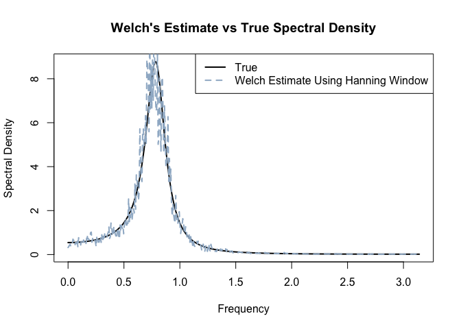<!-- -->

## Hypothesis test using Kolmogorov Smirnov test

``` r
# F(w) = integral from 0 to w of f(u) du / integral from 0 to pi of f(u) du
spectral_density_to_cdf = function(f, omega) {
  # Normalize so total integral = 1
  dw = omega[2] - omega[1]
  total_power = sum(f) * dw
  f_normalized = f / total_power
  
  # Compute cumulative distribution
  F = cumsum(f_normalized) * dw
  
  return(F)
}

true_cdf = spectral_density_to_cdf(spec_density, omega)

hann_cdf = spectral_density_to_cdf(hann_f_hat, omega)
```

``` r
ks_goodness_of_fit_spectral = function(f_hat, f_true, omega, L, window_func,
                                       n, 
                                       overlap = 0.5, n_bootstrap = 1000,
                                       phi = c(1.27, -0.81), sigma = 1,
                                       alpha = 0.05) {
  
  # Convert to CDFs and compute KS statistic
  F_true = spectral_density_to_cdf(f_true, omega)
  F_hat_obs = spectral_density_to_cdf(f_hat, omega)
  D_obs = max(abs(F_true - F_hat_obs))
  
  cat("  Observed D =", round(D_obs, 6), "\n\n")
  
  # Bootstrap to generate the correct distribution under the null
  D_boot = numeric(n_bootstrap)
  pb = txtProgressBar(min = 0, max = n_bootstrap, style = 3)
  for (b in 1:n_bootstrap) {
    # Resample the residuals everytime to ensure temporal dependency. 
    X_boot = numeric(n)
    epsilon = rnorm(n, 0, sigma)
    X_boot[1] = epsilon[1]
    X_boot[2] = phi[1] * X_boot[1] + epsilon[2]
    for (t in 3:n) {
      X_boot[t] = phi[1] * X_boot[t-1] + phi[2] * X_boot[t-2] + epsilon[t]
    }
    # Truncation
    boot_xtk = segment_timeseries(X_boot, L, overlap = overlap)
    # Get window (call the function that was passed in)
    boot_wt = window_func(L)
    # Apply window
    boot_windowed_series = apply(boot_xtk, 2, function(x) x * boot_wt)
    # Calculate u_w
    boot_u = uw(boot_wt)
    # Calculate periodogram for each segment and all frequencies
    boot_periodogram = periodogram_func(uw = boot_u, 
                                       ytk = boot_windowed_series,  
                                       omega_grid = omega)
    # Calculate welch estimate 
    f_hat_boot = f_welch_func(boot_periodogram)
    # Compute D for this bootstrap sample
    F_hat_boot = spectral_density_to_cdf(f_hat_boot, omega)  
    D_boot[b] = max(abs(F_true - F_hat_boot))
    setTxtProgressBar(pb, b)
  }
  close(pb)
  
  # Compute p-value under the null
  # P-value = P(D ≥ D_obs | H0 true)
  #         = proportion of bootstrap D values ≥ observed D
  p_value = mean(D_boot >= D_obs)
  cat("  Bootstrap p-value =", round(p_value, 4), "\n")
  cat("\n  Interpretation:\n")
  cat("    If H0 is true, there is a", round(p_value * 100, 2), 
      "% chance of seeing D ≥", round(D_obs, 6), "\n")
  # Make decision using alpha 0.05
  if (p_value < alpha) {
    cat("Decision: REJECT H0 (p-value =", round(p_value, 4), "< α =", alpha, ")\n")
  } else {
    cat("FAIL TO REJECT H0 (p-value =", round(p_value, 4), "≥ α =", alpha, ")\n")
  }
  # Bootstrap quantile
  quantiles = quantile(D_boot, probs = c(0.90, 0.95, 0.99))
  
  cat("\n  Bootstrap quantiles of D under H0:\n")
  cat("    90th percentile:", round(quantiles[1], 6), "\n")
  cat("    95th percentile:", round(quantiles[2], 6), "\n")
  cat("    99th percentile:", round(quantiles[3], 6), "\n")
  # Return results
  return(list(
    observed_D = D_obs,
    bootstrap_D = D_boot,
    p_value = p_value,
    alpha = alpha,
    reject_H0 = p_value < alpha,
    quantiles = quantiles,
    F_true = F_true,
    F_hat_obs = F_hat_obs,
    f_hat_obs = f_hat  
  ))
}
```

``` r
# retrieve f hat
f_hat_256_hann = results$f_hat_storage[, "hann", "L=256"]

ks_result = ks_goodness_of_fit_spectral(
  f_hat = f_hat_256_hann,
  f_true = spec_density,
  omega = omega,
  L = 256,
  # Pass the function itself
  window_func = hanning_window,  
  n = length(sim_x),            
  overlap = 0.5,
  n_bootstrap = 500,
  phi = c(1.27, -0.81),
  sigma = 1,
  alpha = 0.05
)
```

    ##   Observed D = 0.017887 
    ## 
    ##   |                                                                              |                                                                      |   0%  |                                                                              |                                                                      |   1%  |                                                                              |=                                                                     |   1%  |                                                                              |=                                                                     |   2%  |                                                                              |==                                                                    |   2%  |                                                                              |==                                                                    |   3%  |                                                                              |===                                                                   |   4%  |                                                                              |===                                                                   |   5%  |                                                                              |====                                                                  |   5%  |                                                                              |====                                                                  |   6%  |                                                                              |=====                                                                 |   7%  |                                                                              |=====                                                                 |   8%  |                                                                              |======                                                                |   8%  |                                                                              |======                                                                |   9%  |                                                                              |=======                                                               |   9%  |                                                                              |=======                                                               |  10%  |                                                                              |=======                                                               |  11%  |                                                                              |========                                                              |  11%  |                                                                              |========                                                              |  12%  |                                                                              |=========                                                             |  12%  |                                                                              |=========                                                             |  13%  |                                                                              |==========                                                            |  14%  |                                                                              |==========                                                            |  15%  |                                                                              |===========                                                           |  15%  |                                                                              |===========                                                           |  16%  |                                                                              |============                                                          |  17%  |                                                                              |============                                                          |  18%  |                                                                              |=============                                                         |  18%  |                                                                              |=============                                                         |  19%  |                                                                              |==============                                                        |  19%  |                                                                              |==============                                                        |  20%  |                                                                              |==============                                                        |  21%  |                                                                              |===============                                                       |  21%  |                                                                              |===============                                                       |  22%  |                                                                              |================                                                      |  22%  |                                                                              |================                                                      |  23%  |                                                                              |=================                                                     |  24%  |                                                                              |=================                                                     |  25%  |                                                                              |==================                                                    |  25%  |                                                                              |==================                                                    |  26%  |                                                                              |===================                                                   |  27%  |                                                                              |===================                                                   |  28%  |                                                                              |====================                                                  |  28%  |                                                                              |====================                                                  |  29%  |                                                                              |=====================                                                 |  29%  |                                                                              |=====================                                                 |  30%  |                                                                              |=====================                                                 |  31%  |                                                                              |======================                                                |  31%  |                                                                              |======================                                                |  32%  |                                                                              |=======================                                               |  32%  |                                                                              |=======================                                               |  33%  |                                                                              |========================                                              |  34%  |                                                                              |========================                                              |  35%  |                                                                              |=========================                                             |  35%  |                                                                              |=========================                                             |  36%  |                                                                              |==========================                                            |  37%  |                                                                              |==========================                                            |  38%  |                                                                              |===========================                                           |  38%  |                                                                              |===========================                                           |  39%  |                                                                              |============================                                          |  39%  |                                                                              |============================                                          |  40%  |                                                                              |============================                                          |  41%  |                                                                              |=============================                                         |  41%  |                                                                              |=============================                                         |  42%  |                                                                              |==============================                                        |  42%  |                                                                              |==============================                                        |  43%  |                                                                              |===============================                                       |  44%  |                                                                              |===============================                                       |  45%  |                                                                              |================================                                      |  45%  |                                                                              |================================                                      |  46%  |                                                                              |=================================                                     |  47%  |                                                                              |=================================                                     |  48%  |                                                                              |==================================                                    |  48%  |                                                                              |==================================                                    |  49%  |                                                                              |===================================                                   |  49%  |                                                                              |===================================                                   |  50%  |                                                                              |===================================                                   |  51%  |                                                                              |====================================                                  |  51%  |                                                                              |====================================                                  |  52%  |                                                                              |=====================================                                 |  52%  |                                                                              |=====================================                                 |  53%  |                                                                              |======================================                                |  54%  |                                                                              |======================================                                |  55%  |                                                                              |=======================================                               |  55%  |                                                                              |=======================================                               |  56%  |                                                                              |========================================                              |  57%  |                                                                              |========================================                              |  58%  |                                                                              |=========================================                             |  58%  |                                                                              |=========================================                             |  59%  |                                                                              |==========================================                            |  59%  |                                                                              |==========================================                            |  60%  |                                                                              |==========================================                            |  61%  |                                                                              |===========================================                           |  61%  |                                                                              |===========================================                           |  62%  |                                                                              |============================================                          |  62%  |                                                                              |============================================                          |  63%  |                                                                              |=============================================                         |  64%  |                                                                              |=============================================                         |  65%  |                                                                              |==============================================                        |  65%  |                                                                              |==============================================                        |  66%  |                                                                              |===============================================                       |  67%  |                                                                              |===============================================                       |  68%  |                                                                              |================================================                      |  68%  |                                                                              |================================================                      |  69%  |                                                                              |=================================================                     |  69%  |                                                                              |=================================================                     |  70%  |                                                                              |=================================================                     |  71%  |                                                                              |==================================================                    |  71%  |                                                                              |==================================================                    |  72%  |                                                                              |===================================================                   |  72%  |                                                                              |===================================================                   |  73%  |                                                                              |====================================================                  |  74%  |                                                                              |====================================================                  |  75%  |                                                                              |=====================================================                 |  75%  |                                                                              |=====================================================                 |  76%  |                                                                              |======================================================                |  77%  |                                                                              |======================================================                |  78%  |                                                                              |=======================================================               |  78%  |                                                                              |=======================================================               |  79%  |                                                                              |========================================================              |  79%  |                                                                              |========================================================              |  80%  |                                                                              |========================================================              |  81%  |                                                                              |=========================================================             |  81%  |                                                                              |=========================================================             |  82%  |                                                                              |==========================================================            |  82%  |                                                                              |==========================================================            |  83%  |                                                                              |===========================================================           |  84%  |                                                                              |===========================================================           |  85%  |                                                                              |============================================================          |  85%  |                                                                              |============================================================          |  86%  |                                                                              |=============================================================         |  87%  |                                                                              |=============================================================         |  88%  |                                                                              |==============================================================        |  88%  |                                                                              |==============================================================        |  89%  |                                                                              |===============================================================       |  89%  |                                                                              |===============================================================       |  90%  |                                                                              |===============================================================       |  91%  |                                                                              |================================================================      |  91%  |                                                                              |================================================================      |  92%  |                                                                              |=================================================================     |  92%  |                                                                              |=================================================================     |  93%  |                                                                              |==================================================================    |  94%  |                                                                              |==================================================================    |  95%  |                                                                              |===================================================================   |  95%  |                                                                              |===================================================================   |  96%  |                                                                              |====================================================================  |  97%  |                                                                              |====================================================================  |  98%  |                                                                              |===================================================================== |  98%  |                                                                              |===================================================================== |  99%  |                                                                              |======================================================================|  99%  |                                                                              |======================================================================| 100%
    ##   Bootstrap p-value = 0.584 
    ## 
    ##   Interpretation:
    ##     If H0 is true, there is a 58.4 % chance of seeing D ≥ 0.017887 
    ## FAIL TO REJECT H0 (p-value = 0.584 ≥ α = 0.05 )
    ## 
    ##   Bootstrap quantiles of D under H0:
    ##     90th percentile: 0.030933 
    ##     95th percentile: 0.034739 
    ##     99th percentile: 0.046999

# Parametric approach

## Box-Jenkins

``` r
sim_x %>% tsdisplay(main = "Simulated Series")
```

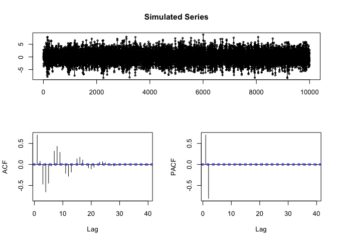<!-- -->

``` r
# Split into train and test
n = length(sim_x) 
n_train = floor(0.8 * n)
n_test = n - n_train
train_x = sim_x[1:n_train]
test_x = sim_x[(n_train + 1):n]

# ADF test on training data
adf_result = adf.test(train_x)
```

    ## Warning in adf.test(train_x): p-value smaller than printed p-value

``` r
cat("ADF test p-value:", adf_result$p.value, "\n")
```

    ## ADF test p-value: 0.01

``` r
if (adf_result$p.value < 0.05) {
  cat("Series is stationary (p < 0.05)\n")
} else {
  cat("Series may need differencing (p >= 0.05)\n")
}
```

    ## Series is stationary (p < 0.05)

``` r
# Plot ACF and PACF
par(mfrow = c(1, 2))
acf(train_x, lag.max = 40, main = "ACF - Training Set")
pacf(train_x, lag.max = 40, main = "PACF - Training Set")
```

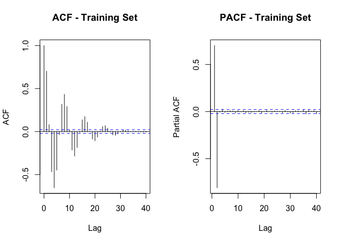<!-- -->

``` r
par(mfrow = c(1, 1))


# Manual identification
cat("From ACF/PACF, we expect AR(2) since:\n")
```

    ## From ACF/PACF, we expect AR(2) since:

``` r
cat("- PACF should cut off after lag 2\n")
```

    ## - PACF should cut off after lag 2

``` r
cat("- ACF should decay exponentially\n\n")
```

    ## - ACF should decay exponentially

``` r
# Fit AR(2) manually
ar2_model = arima(train_x, order = c(2, 0, 0))
print(ar2_model)
```

    ## 
    ## Call:
    ## arima(x = train_x, order = c(2, 0, 0))
    ## 
    ## Coefficients:
    ##          ar1      ar2  intercept
    ##       1.2681  -0.8091    -0.0300
    ## s.e.  0.0066   0.0066     0.0206
    ## 
    ## sigma^2 estimated as 0.995:  log likelihood = -11332.68,  aic = 22673.35

``` r
ar_yw = ar(sim_x, order.max = 2, method = "yw")
# Yule–Walker estimates of phi_1, phi_2
cat("Yule-Walker estimates are: phi1 =", ar_yw$ar[1], ",phi2 =", ar_yw$ar[2])
```

    ## Yule-Walker estimates are: phi1 = 1.266028 ,phi2 = -0.8091923

``` r
# Residual diagnostics
residuals_ar2 = residuals(ar2_model)

par(mfrow = c(2, 2))

# Plot residuals

plot(residuals_ar2, type = "l", main = "Residuals", ylab = "Residuals")
abline(h = 0, col = "red", lty = 2)

png("ar_residuals.png",
    width = 4000,      
    height = 3000,
    res = 600)   
par(mfrow=c(1,2))
# ACF of residuals (should look like white noise)
acf(residuals_ar2, main = "ACF of Residuals")
# Histogram
hist(residuals_ar2, breaks = 30, main = "Histogram of Residuals",
     xlab = "Residuals", col = "lightblue", xlim=c(-4,4))
dev.off()
```

    ## quartz_off_screen 
    ##                 2

``` r
# Q-Q plot
qqnorm(residuals_ar2)
qqline(residuals_ar2, col = "red")

par(mfrow = c(1, 1))
```

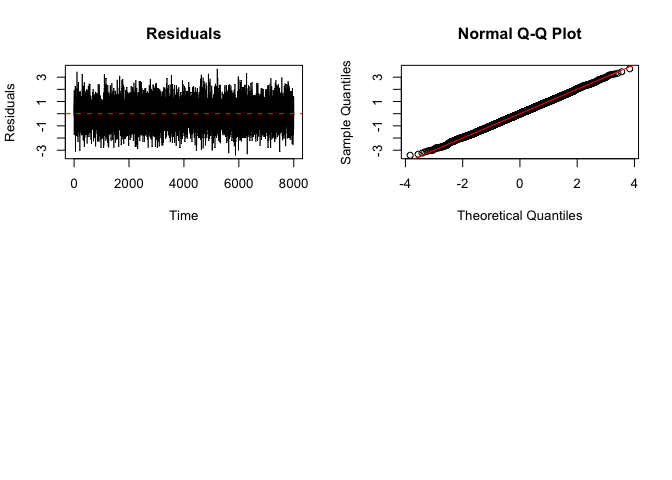<!-- -->

``` r
# Ljung-Box test (H0: residuals are white noise)
lb_test = Box.test(residuals_ar2, lag = 20, type = "Ljung-Box")
cat("\nLjung-Box test p-value:", lb_test$p.value, "\n")
```

    ## 
    ## Ljung-Box test p-value: 0.7466304

``` r
if (lb_test$p.value > 0.05) {
  cat("Residuals appear to be white noise (p > 0.05) \n")
} else {
  cat("Residuals may not be white noise (p <= 0.05)\n")
}
```

    ## Residuals appear to be white noise (p > 0.05)

``` r
# Forecast test set length
forecast_horizon = n_test
forecasts = predict(ar2_model, n.ahead = forecast_horizon)

# Extract point forecasts and prediction intervals
forecast_mean = forecasts$pred
forecast_se = forecasts$se

# 95% prediction intervals
lower_95 = forecast_mean - 1.96 * forecast_se
upper_95 = forecast_mean + 1.96 * forecast_se

# Compute forecast errors
forecast_errors = test_x - forecast_mean

# Error metrics

rmse = sqrt(mean(forecast_errors^2))
```

### Compute spectral density

``` r
# Function to compute spectral density
compute_arma_spectral_density = function(phi, theta, sigma2, omega) {
  spec_dens = numeric(length(omega))
  
  for (i in 1:length(omega)) {
    w = omega[i]
    
    # AR polynomial: 1 - phi_1*z - ... - phi_p*z^p
    if (length(phi) > 0) {
      ar_poly = 1 - sum(phi * exp(-1i * w * (1:length(phi))))
    } else {
      ar_poly = 1
    }
    
    # MA polynomial: 1 + theta_1*z + ... + theta_q*z^q
    if (length(theta) > 0) {
      ma_poly = 1 + sum(theta * exp(-1i * w * (1:length(theta))))
    } else {
      ma_poly = 1
    }
    
    # Spectral density: sigma^2 * |MA|^2 / (2*pi*|AR|^2)
    spec_dens[i] = sigma2 * Mod(ma_poly)^2 / (2 * pi * Mod(ar_poly)^2)
  }
  
  return(spec_dens)
}
```

### AR(2) spectral density

``` r
ar2_spec = compute_arma_spectral_density(ar_yw$ar, theta = 0, 
                                         sigma2 =  sigma, omega = omega)

png("ar2plot.png",
    width = 4000,      
    height = 3000,
    res = 600)        
plot(omega, spec_density, type = "l", lwd = 2, col = "black",
     xlab = "Frequency", ylab = " Density")
lines(omega, ar2_spec,
      col = "slategray3", lwd = 2, lty = 2)
legend("topright",
       legend = c("True spectral density", "AR(2) Yule-Walker"),
       col = c("black", "slategray3"),
       lty = c(1, 2), lwd = c(2, 2))
dev.off()
```

    ## quartz_off_screen 
    ##                 2

### Hypothesis test using Cramer von mises

``` r
delta_omega = mean(diff(omega))

F_hat_obs_test = spectral_density_to_cdf(ar2_spec, omega)

F_true_test = spectral_density_to_cdf(spec_density, omega)

T_obs = sum((F_hat_obs_test - F_true_test)^2) * delta_omega


cvm_goodness_of_fit_spectral = function(f_hat, f_true, omega, n, 
                                        n_bootstrap = 1000,
                                       phi = c(1.27, -0.81), sigma = 1,
                                       alpha = 0.05, resid) {
  
  # Convert to CDFs and compute KS statistic
  F_true = spectral_density_to_cdf(f_true, omega)
  F_hat_obs = spectral_density_to_cdf(f_hat, omega)
  delta_omega = mean(diff(omega))
  T_obs = sum((F_hat_obs - F_true)^2) * delta_omega
  
  cat(" T_CvM =", round(T_obs, 6), "\n\n")
  
  # Bootstrap to generate the correct distribution under the null
  cat("  Under H0: Data from AR(2) with phi = (", paste(phi, collapse=", "), 
      "), sigma =", sigma, "\n")
  
  T_boot = numeric(n_bootstrap)
  
  pb = txtProgressBar(min = 0, max = n_bootstrap, style = 3)
  
  # Initialize the residuals
  epsilon = resid
  for (b in 1:n_bootstrap) {
    # Generate data under H0 (from true AR(2) model)
    X_boot = numeric(n)
    epsilon = sample(resid, size = n, replace = TRUE)
    X_boot[1] = epsilon[1]
    X_boot[2] = phi[1] * X_boot[1] + epsilon[2]
    for (t in 3:n) {
      X_boot[t] = phi[1] * X_boot[t-1] + phi[2] * X_boot[t-2] + epsilon[t]
    }
    
    # Apply SAME estimation procedure
    ar_boot = ar(X_boot, order.max = 2, method = "yw")
    f_hat_boot = compute_arma_spectral_density(ar_boot$ar, theta = 0, 
                                         sigma2 =  sigma, omega = omega)
    # Compute D for this bootstrap sample
    F_hat_boot = spectral_density_to_cdf(f_hat_boot, omega) 
    T_boot[b] = sum((F_hat_boot - F_true)^2) * mean(diff(omega))
    
    setTxtProgressBar(pb, b)
  }
  close(pb)
  
  # Compute p-value under the null
  cat("\n\nStep 3: Computing p-value...\n")
  
  # P-value = P(D ≥ D_obs | H0 true)
  #         = proportion of bootstrap D values ≥ observed D
  p_value = mean(T_boot >= T_obs)
  
  cat("  Bootstrap p-value =", round(p_value, 4), "\n")
  
  # Make decision using alpha = .5
  cat("\nStep 4: Hypothesis test decision...\n")
  cat("  Significance level: α =", alpha, "\n")
  
  if (p_value < alpha) {
    cat("REJECT H0 (p-value =", round(p_value, 4), "< α =", alpha, ")\n")
  } else {
    cat(" FAIL TO REJECT H0 (p-value =", round(p_value, 4), "≥ α =", alpha, ")\n")

  }
  
  # Compute bootstrap quantiles for reference
  quantiles = quantile(T_boot, probs = c(0.90, 0.95, 0.99))
  
  cat("\n  Bootstrap quantiles of D under H0:\n")
  cat("    90th percentile:", round(quantiles[1], 6), "\n")
  cat("    95th percentile:", round(quantiles[2], 6), "\n")
  cat("    99th percentile:", round(quantiles[3], 6), "\n")
  
  # Return results
  return(list(
    observed_T = T_obs,
    bootstrap_T = T_boot,
    p_value = p_value,
    alpha = alpha,
    reject_H0 = p_value < alpha,
    quantiles = quantiles,
    F_true = F_true,
    F_hat_obs = F_hat_obs,
    f_hat_obs = f_hat  
  ))
}

# Call it
parametric_cvm_result = cvm_goodness_of_fit_spectral(f_hat = ar2_spec, 
                                                     f_true = spec_density, 
                                                     omega = omega,
                                                     n=length(sim_x),
                                                     resid = ar2_model$residuals)
```

    ##  T_CvM = 1.1e-05 
    ## 
    ##   Under H0: Data from AR(2) with phi = ( 1.27, -0.81 ), sigma = 1 
    ##   |                                                                              |                                                                      |   0%  |                                                                              |                                                                      |   1%  |                                                                              |=                                                                     |   1%  |                                                                              |=                                                                     |   2%  |                                                                              |==                                                                    |   2%  |                                                                              |==                                                                    |   3%  |                                                                              |==                                                                    |   4%  |                                                                              |===                                                                   |   4%  |                                                                              |===                                                                   |   5%  |                                                                              |====                                                                  |   5%  |                                                                              |====                                                                  |   6%  |                                                                              |=====                                                                 |   6%  |                                                                              |=====                                                                 |   7%  |                                                                              |=====                                                                 |   8%  |                                                                              |======                                                                |   8%  |                                                                              |======                                                                |   9%  |                                                                              |=======                                                               |   9%  |                                                                              |=======                                                               |  10%  |                                                                              |=======                                                               |  11%  |                                                                              |========                                                              |  11%  |                                                                              |========                                                              |  12%  |                                                                              |=========                                                             |  12%  |                                                                              |=========                                                             |  13%  |                                                                              |=========                                                             |  14%  |                                                                              |==========                                                            |  14%  |                                                                              |==========                                                            |  15%  |                                                                              |===========                                                           |  15%  |                                                                              |===========                                                           |  16%  |                                                                              |============                                                          |  16%  |                                                                              |============                                                          |  17%  |                                                                              |============                                                          |  18%  |                                                                              |=============                                                         |  18%  |                                                                              |=============                                                         |  19%  |                                                                              |==============                                                        |  19%  |                                                                              |==============                                                        |  20%  |                                                                              |==============                                                        |  21%  |                                                                              |===============                                                       |  21%  |                                                                              |===============                                                       |  22%  |                                                                              |================                                                      |  22%  |                                                                              |================                                                      |  23%  |                                                                              |================                                                      |  24%  |                                                                              |=================                                                     |  24%  |                                                                              |=================                                                     |  25%  |                                                                              |==================                                                    |  25%  |                                                                              |==================                                                    |  26%  |                                                                              |===================                                                   |  26%  |                                                                              |===================                                                   |  27%  |                                                                              |===================                                                   |  28%  |                                                                              |====================                                                  |  28%  |                                                                              |====================                                                  |  29%  |                                                                              |=====================                                                 |  29%  |                                                                              |=====================                                                 |  30%  |                                                                              |=====================                                                 |  31%  |                                                                              |======================                                                |  31%  |                                                                              |======================                                                |  32%  |                                                                              |=======================                                               |  32%  |                                                                              |=======================                                               |  33%  |                                                                              |=======================                                               |  34%  |                                                                              |========================                                              |  34%  |                                                                              |========================                                              |  35%  |                                                                              |=========================                                             |  35%  |                                                                              |=========================                                             |  36%  |                                                                              |==========================                                            |  36%  |                                                                              |==========================                                            |  37%  |                                                                              |==========================                                            |  38%  |                                                                              |===========================                                           |  38%  |                                                                              |===========================                                           |  39%  |                                                                              |============================                                          |  39%  |                                                                              |============================                                          |  40%  |                                                                              |============================                                          |  41%  |                                                                              |=============================                                         |  41%  |                                                                              |=============================                                         |  42%  |                                                                              |==============================                                        |  42%  |                                                                              |==============================                                        |  43%  |                                                                              |==============================                                        |  44%  |                                                                              |===============================                                       |  44%  |                                                                              |===============================                                       |  45%  |                                                                              |================================                                      |  45%  |                                                                              |================================                                      |  46%  |                                                                              |=================================                                     |  46%  |                                                                              |=================================                                     |  47%  |                                                                              |=================================                                     |  48%  |                                                                              |==================================                                    |  48%  |                                                                              |==================================                                    |  49%  |                                                                              |===================================                                   |  49%  |                                                                              |===================================                                   |  50%  |                                                                              |===================================                                   |  51%  |                                                                              |====================================                                  |  51%  |                                                                              |====================================                                  |  52%  |                                                                              |=====================================                                 |  52%  |                                                                              |=====================================                                 |  53%  |                                                                              |=====================================                                 |  54%  |                                                                              |======================================                                |  54%  |                                                                              |======================================                                |  55%  |                                                                              |=======================================                               |  55%  |                                                                              |=======================================                               |  56%  |                                                                              |========================================                              |  56%  |                                                                              |========================================                              |  57%  |                                                                              |========================================                              |  58%  |                                                                              |=========================================                             |  58%  |                                                                              |=========================================                             |  59%  |                                                                              |==========================================                            |  59%  |                                                                              |==========================================                            |  60%  |                                                                              |==========================================                            |  61%  |                                                                              |===========================================                           |  61%  |                                                                              |===========================================                           |  62%  |                                                                              |============================================                          |  62%  |                                                                              |============================================                          |  63%  |                                                                              |============================================                          |  64%  |                                                                              |=============================================                         |  64%  |                                                                              |=============================================                         |  65%  |                                                                              |==============================================                        |  65%  |                                                                              |==============================================                        |  66%  |                                                                              |===============================================                       |  66%  |                                                                              |===============================================                       |  67%  |                                                                              |===============================================                       |  68%  |                                                                              |================================================                      |  68%  |                                                                              |================================================                      |  69%  |                                                                              |=================================================                     |  69%  |                                                                              |=================================================                     |  70%  |                                                                              |=================================================                     |  71%  |                                                                              |==================================================                    |  71%  |                                                                              |==================================================                    |  72%  |                                                                              |===================================================                   |  72%  |                                                                              |===================================================                   |  73%  |                                                                              |===================================================                   |  74%  |                                                                              |====================================================                  |  74%  |                                                                              |====================================================                  |  75%  |                                                                              |=====================================================                 |  75%  |                                                                              |=====================================================                 |  76%  |                                                                              |======================================================                |  76%  |                                                                              |======================================================                |  77%  |                                                                              |======================================================                |  78%  |                                                                              |=======================================================               |  78%  |                                                                              |=======================================================               |  79%  |                                                                              |========================================================              |  79%  |                                                                              |========================================================              |  80%  |                                                                              |========================================================              |  81%  |                                                                              |=========================================================             |  81%  |                                                                              |=========================================================             |  82%  |                                                                              |==========================================================            |  82%  |                                                                              |==========================================================            |  83%  |                                                                              |==========================================================            |  84%  |                                                                              |===========================================================           |  84%  |                                                                              |===========================================================           |  85%  |                                                                              |============================================================          |  85%  |                                                                              |============================================================          |  86%  |                                                                              |=============================================================         |  86%  |                                                                              |=============================================================         |  87%  |                                                                              |=============================================================         |  88%  |                                                                              |==============================================================        |  88%  |                                                                              |==============================================================        |  89%  |                                                                              |===============================================================       |  89%  |                                                                              |===============================================================       |  90%  |                                                                              |===============================================================       |  91%  |                                                                              |================================================================      |  91%  |                                                                              |================================================================      |  92%  |                                                                              |=================================================================     |  92%  |                                                                              |=================================================================     |  93%  |                                                                              |=================================================================     |  94%  |                                                                              |==================================================================    |  94%  |                                                                              |==================================================================    |  95%  |                                                                              |===================================================================   |  95%  |                                                                              |===================================================================   |  96%  |                                                                              |====================================================================  |  96%  |                                                                              |====================================================================  |  97%  |                                                                              |====================================================================  |  98%  |                                                                              |===================================================================== |  98%  |                                                                              |===================================================================== |  99%  |                                                                              |======================================================================|  99%  |                                                                              |======================================================================| 100%
    ## 
    ## 
    ## Step 3: Computing p-value...
    ##   Bootstrap p-value = 0.701 
    ## 
    ## Step 4: Hypothesis test decision...
    ##   Significance level: α = 0.05 
    ##  FAIL TO REJECT H0 (p-value = 0.701 ≥ α = 0.05 )
    ## 
    ##   Bootstrap quantiles of D under H0:
    ##     90th percentile: 8e-05 
    ##     95th percentile: 0.000109 
    ##     99th percentile: 0.000165

## Play around with different models:

### Error measure as a function of model order

``` r
# Function to compute error rate
compute_error_rate = function(train_x, pq_grid, spec_density_true, omega){
  pb = txtProgressBar(min = 0, max = nrow(pq_grid), style = 3)
  error_matrix = matrix(NA_real_, nrow = nrow(pq_grid), ncol = 2,
                    dimnames = list(paste0("p=", pq_grid$p, ",q=", pq_grid$q),
    c("l1_error", "kl_dist")
  )
)
  for(i in 1:nrow(pq_grid)){
    setTxtProgressBar(pb, i)
    p = pq_grid$p[i]
    q = pq_grid$q[i]
    # Fit the model
    arma_mod = arima(train_x, order = c(p, 0, q))
    # Obtain the poly
    coef_model = coef(arma_mod)
    # Extract AR coefficients
    if (p > 0) {
      phi_est = coef_model[grep("^ar", names(coef_model))]
    } else {
      phi_est = numeric(0)
    }
    
    # Extract MA coefficients
    if (q > 0) {
      theta_est = coef_model[grep("^ma", names(coef_model))]
    } else {
      theta_est = numeric(0)
    }
    
    # Estimate sigma^2
    sigma2_est = arma_mod$sigma2
    # Compute spectral density using poly
    spec_density_est = compute_arma_spectral_density(phi_est, theta_est,
                                                     sigma2_est, omega)
    # Compute the error 
    diff = spec_density_est - spec_density_true
    dw = omega[2] - omega[1]
    error_matrix[i,1] = sum(abs(diff)) * dw
    error_matrix[i,2] = compute_kl_divergence(spec_density_true, spec_density_est, omega)
  }
  close(pb)
  return(error_matrix)
}

# Define range of model orders to test
p_values = 0:5  
q_values = 0:5 

# Initialize storage for results
n_p = length(p_values)
n_q = length(q_values)

pq_grid = expand.grid(p = 0:5, q = 0:5)
# pq_grid = pq_grid[-1,]

# call it
spectral_error_grid = compute_error_rate(train_x, pq_grid,
                                             spec_density_true = spec_density,
                                             omega = omega)
```

    ##   |                                                                              |                                                                      |   0%  |                                                                              |==                                                                    |   3%  |                                                                              |====                                                                  |   6%  |                                                                              |======                                                                |   8%  |                                                                              |========                                                              |  11%  |                                                                              |==========                                                            |  14%  |                                                                              |============                                                          |  17%  |                                                                              |==============                                                        |  19%  |                                                                              |================                                                      |  22%  |                                                                              |==================                                                    |  25%  |                                                                              |===================                                                   |  28%

    ## Warning in arima(train_x, order = c(p, 0, q)): possible convergence problem:
    ## optim gave code = 1

    ##   |                                                                              |=====================                                                 |  31%

    ## Warning in arima(train_x, order = c(p, 0, q)): possible convergence problem:
    ## optim gave code = 1

    ##   |                                                                              |=======================                                               |  33%

    ## Warning in arima(train_x, order = c(p, 0, q)): possible convergence problem:
    ## optim gave code = 1

    ##   |                                                                              |=========================                                             |  36%  |                                                                              |===========================                                           |  39%  |                                                                              |=============================                                         |  42%  |                                                                              |===============================                                       |  44%

    ## Warning in arima(train_x, order = c(p, 0, q)): possible convergence problem:
    ## optim gave code = 1

    ##   |                                                                              |=================================                                     |  47%

    ## Warning in arima(train_x, order = c(p, 0, q)): possible convergence problem:
    ## optim gave code = 1

    ##   |                                                                              |===================================                                   |  50%

    ## Warning in arima(train_x, order = c(p, 0, q)): possible convergence problem:
    ## optim gave code = 1

    ##   |                                                                              |=====================================                                 |  53%  |                                                                              |=======================================                               |  56%  |                                                                              |=========================================                             |  58%  |                                                                              |===========================================                           |  61%

    ## Warning in arima(train_x, order = c(p, 0, q)): possible convergence problem:
    ## optim gave code = 1

    ##   |                                                                              |=============================================                         |  64%

    ## Warning in arima(train_x, order = c(p, 0, q)): possible convergence problem:
    ## optim gave code = 1

    ##   |                                                                              |===============================================                       |  67%

    ## Warning in arima(train_x, order = c(p, 0, q)): possible convergence problem:
    ## optim gave code = 1

    ##   |                                                                              |=================================================                     |  69%  |                                                                              |===================================================                   |  72%  |                                                                              |====================================================                  |  75%  |                                                                              |======================================================                |  78%

    ## Warning in arima(train_x, order = c(p, 0, q)): possible convergence problem:
    ## optim gave code = 1

    ##   |                                                                              |========================================================              |  81%

    ## Warning in arima(train_x, order = c(p, 0, q)): possible convergence problem:
    ## optim gave code = 1

    ##   |                                                                              |==========================================================            |  83%  |                                                                              |============================================================          |  86%  |                                                                              |==============================================================        |  89%  |                                                                              |================================================================      |  92%  |                                                                              |==================================================================    |  94%

    ## Warning in arima(train_x, order = c(p, 0, q)): possible convergence problem:
    ## optim gave code = 1

    ##   |                                                                              |====================================================================  |  97%

    ## Warning in arima(train_x, order = c(p, 0, q)): possible convergence problem:
    ## optim gave code = 1

    ##   |                                                                              |======================================================================| 100%

    ## Warning in arima(train_x, order = c(p, 0, q)): possible convergence problem:
    ## optim gave code = 1

### Plot

``` r
# 
l1_error_df = data.frame(
  p = pq_grid$p,
  q = pq_grid$q,
  l1_error = spectral_error_grid[,1],
  kl_dist = spectral_error_grid[,2]
)


ggplot(l1_error_df, aes(x = p, y = q, fill = l1_error)) +
  geom_tile(color = "white") +
  scale_fill_distiller(palette = "Blues", direction = 1) +

  geom_point(aes(x = 2, y = 0), color = "black", shape = 1,
             size = 3, stroke = 1.5) +
  labs(
    title = "L1 Error Heatmap for ARMA(p, q)",
    x = "AR order p",
    y = "MA order q",
    fill = "L1 Error"
  ) +
  theme_minimal()
```

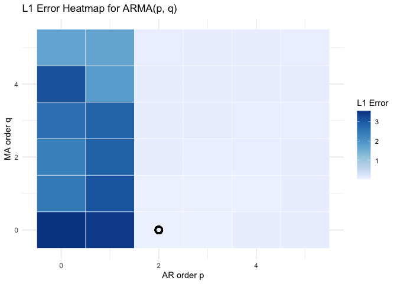<!-- -->

``` r
l1_error_df$arma_label = paste0("(", l1_error_df$p, ",", l1_error_df$q, ")")

ggplot(l1_error_df, aes(x = arma_label, y = l1_error)) +
  geom_line(group = 1, color = "darkblue") +
  geom_point(color = "darkblue") +
  labs(
    x = "ARMA(p, q)",
    y = "L1 Error",
    title = "L1 Error Across ARMA(p, q) Models"
  ) +
  theme_minimal() +
  theme(
    axis.text.x = element_text(angle = 90, hjust = 1, size = 6)
  )
```

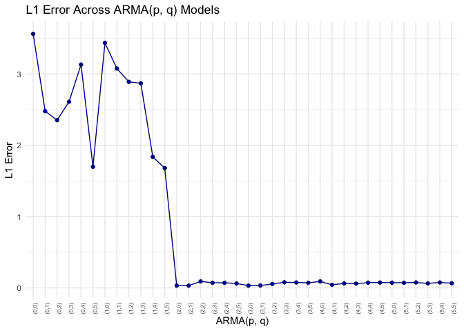<!-- -->

``` r
kl_dvg_error_plot = ggplot(l1_error_df, aes(x = arma_label, y = kl_dist)) +
  geom_line(group = 1, color = "darkblue") +
  geom_point(color = "darkblue") +
  labs(
    x = "ARMA(p, q)",
    y = "KL Distance",
    title = "KL Divergence Across ARMA(p, q) Models"
  ) +
  theme_minimal() +
  theme(
    axis.text.x = element_text(angle = 90, hjust = 1, size = 15)
  )

ggsave("kl_dvg_error_plot.png",
       plot = kl_dvg_error_plot,
       path = getwd(),
       width = 9, height = 7, dpi = 1200,bg = "white")
```
